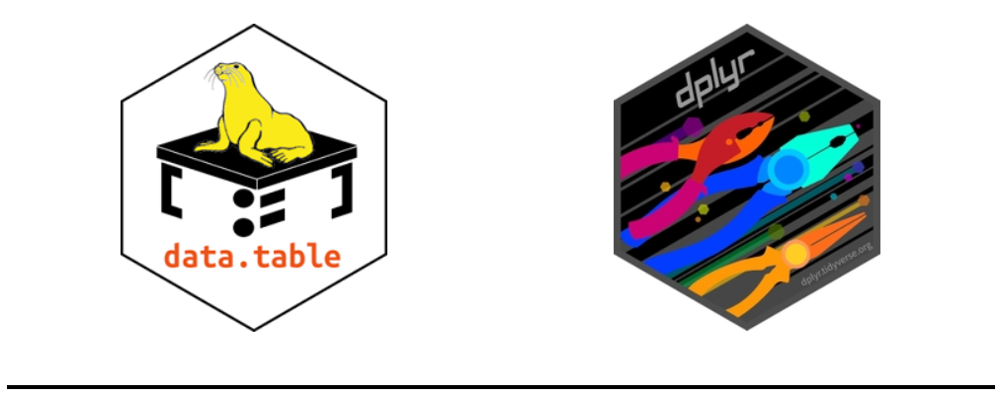
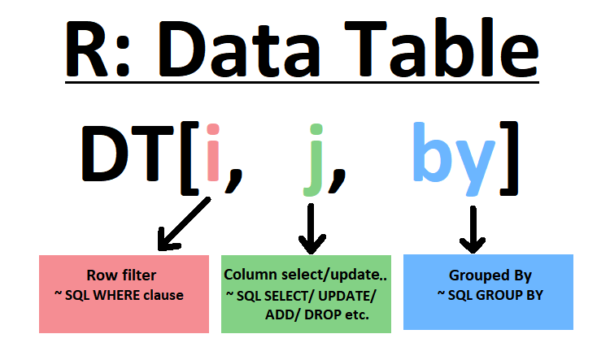
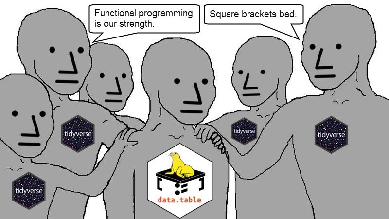
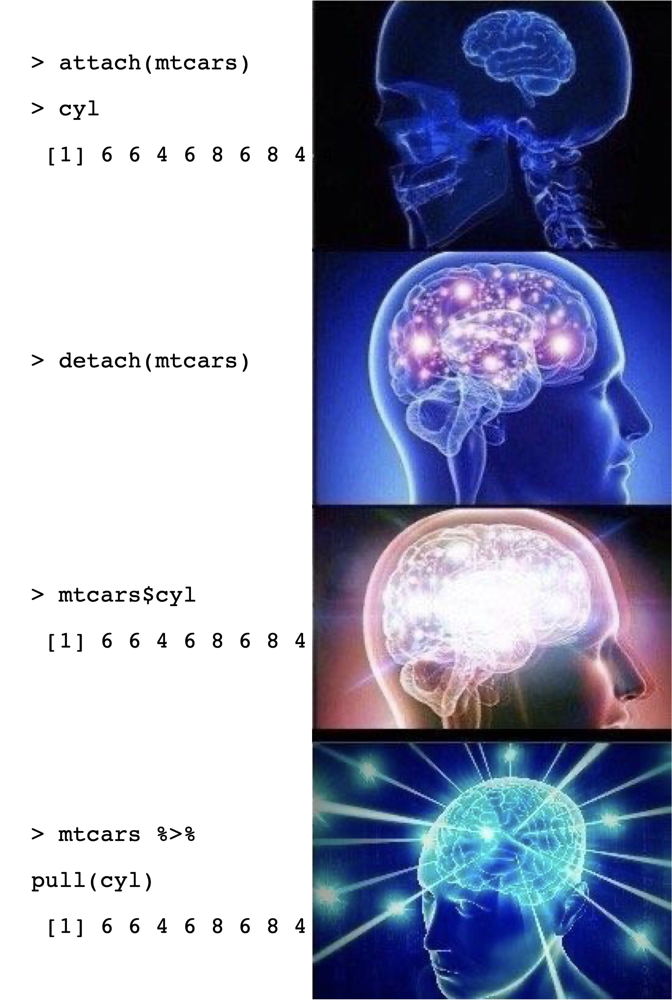

```{r setup, include=FALSE}
options(htmltools.dir.version = FALSE)
knitr::opts_chunk$set(
  fig.width=9, fig.height=3.5, fig.retina=3,
  out.width = "100%",
  cache = FALSE,
  echo = TRUE,
  message = FALSE, 
  warning = FALSE,
  hiline = TRUE
)
library(fontawesome)
```

```{r xaringan-themer, include=FALSE, warning=FALSE}
library(xaringanthemer)
style_duo_accent(
  primary_color = "#1381B0",
  secondary_color = "#FF961C",
  inverse_header_color = "#FFFFFF",
  inverse_background_color = "#8d99ae",
  base_font_size = "25px",
  text_font_size=  "1.25rem",
  link_decoration = "underline dotted red",
  code_font_size = "1.25rem",
  code_inline_color= "#003049",
  code_inline_background_color = "#FFFCFE",
  blockquote_left_border_color = "#003049"
  )

```

```{r xaringan-tachyons, echo=FALSE}
library(xaringanExtra)
xaringanExtra::use_tachyons()
```

```{r xaringan-animate-all, echo=FALSE, eval=TRUE}
xaringanExtra::use_animate_all("fade")
```

```{r xaringan-extra-styles, eval=TRUE, echo=FALSE}
xaringanExtra::use_extra_styles(
  hover_code_line = TRUE,     
)
```

```{r html output, eval=TRUE, include=FALSE}
options(htmltools.dir.version = FALSE, htmltools.preserve.raw = FALSE)
```

```{css, echo = F}
.dk-section-title {
box-shadow: inset 0 0 0 1000px rgba(0,0,0,0.5);
}

.dk-section-title h1 {
  color: #f3f3f3;
  font-size: 100px;
  line-height: 1;
}

.smallcode .remark-code { /*Change made here*/
  font-size: 75% !important;
}

```

### About me

.pull-left[
  

[`r fa(name = "twitter")` @LuisDVerde](https://twitter.com/LuisDVerde)  
[`r fa(name = "github")` @LuisDVA](https://github.com/luisdva)  
[`r fa(name = "link")` liomys.mx](https://liomys.mx)  
[`r fa(name = "paper-plane")` luis@liomys.mx](mailto:luis@liomys.mx)
]

.pull-right[
  
🇲🇽 
🇦🇺
🇨🇭
🇨🇱  

- Mammals, conservation, macroecology
- Evolution, ecomorphology
- Phylogenetic Comparative Methods
- Biogeography, R as a GIS
- R user since 2011  
- R 'blogger' since 2015
]

---

## You:

- are familiar with basic data types and objects in R  

- can use functions and arguments  

- have R and RStudio running  

- can install and load packages

---

class: inverse

## More about you

(shared document)  
- When did you start using R?

- Why did you start using R?

- How did you learn?

---

class: title-slide, middle, center    

# Course Overview
### 4 sessions, Mon-Thu, 14:00-20:00 UTC+01:00

---

## Monday - Introduction

- Syntax quirks and idiosyncrasies

- Milestones and changes in R through time 

- R ‘dialects’

- The file system

- Directory structures, file paths and names  

- Project and workflow organization

- Projects, 📦 {`here`}  and relative paths

---

## Tuesday - Usable data

- Organizing data in spreadsheets

- Principles of rectangular data

- Tools for data rectangling (tidyverse-oriented)  

- Data types and missing values 

---

## Wednesday - Increasing efficiency


- Iteration, writing loops and using 📦 {`purrr`}

  - Apply functions to many things at once

  - Reading many files at once

  - Modifying and exporting multiple objects

- Useful addins and helpers

- Regular expressions for working with text strings 

---

## Thursday - Overcoming errors and getting unstuck


- Friendly online resources

- Building web searches to solve common problems

- Identifying the best solutions

- Creating reproducible examples with the 📦 {`reprex`} package 

---

# Not part of this course

- Making plots & maps

- Making nice-looking tables

- Statistical analyses

- Package development

- RMarkdown

---

## Sessions and structure

- Exercises 

- Challenges

- Live coding

- Breaks

---

# My setup

- R v4.1.2  

- RStudio 2022.02.0 "Prairie Trillium" Preview Release  

- Default theme and pane layout  

- Linux Mint 20.3

---

class: inverse 

# Your setup
(shared document)  
- Operating System

- R version

- IDE

- Customization (fonts, editor themes, layouts)

---

class: dk-section-title
background-image: url("imgs/trote.jpg")
background-size: cover

# Syntax quirks and idiosyncrasies

---

## .tc[
_What is `r fa(name = "r-project")`?_]

> "At the heart of the R project is a dynamic, lazy, functional, object-oriented programming language...

>This **rather unlikely linguistic cocktail** would probably never have been prepared by computer scientists, yet the language has become surprisingly popular...

> Most sessions are interactive, the user loads data and starts by plotting the data and making various simple summaries." 

.tr[
Morandat et al. (2012)  
[Evaluating the Design of the R Language](https://link.springer.com/chapter/10.1007/978-3-642-31057-7_6)
]

---

class: middle  
  
.tc[
.black.f2[`inherits(R,"S") == TRUE`]  
]  

<br/>
.tr[
Roger Peng  
_Teaching R to New Users - From tapply to the Tidyverse_  
useR! 2018 Keynote  
📼 [video](https://www.youtube.com/watch?v=5033jBHFiHE)  
[summary](https://simplystatistics.org/posts/2018-07-12-use-r-keynote-2018/)
]

---

## Design principles and requirements

_programming language? interactive environment? statistical package?_

<br/>

>.b.orange[S] had its roots in data analysis... its inventors were focused on figuring out how to make data analysis easier, first for themselves, and then eventually for others.

.tr[
📖 Roger Peng (2020)  
History and Overview of R  
[R Programming for Data Science](https://bookdown.org/rdpeng/rprogdatascience/history-and-overview-of-r.html)
]

---

## Design principles and requirements

<br/><br/>
Ease the transition from user to developer, allow users to:  

.pull-left[
Analyze and plot data interactively
(command-line based)
] 

.pull-right[
Develop new methods, custom tools, or programs
(traditional programming)
]

---

class: dk-section-title
background-image:url("imgs/brigalow.jpg")
background-size: cover

# `r fa(name = "r-project")`
# .white[Development history (and how this affects how we work)]

---

class: middle 

.b.purple[1991-1993] Developed by Ross Ihaka and Robert Gentleman    

.purple.b[1995] Established as an open source project

.purple.b[1997] R Core Team formed & CRAN established

.b.purple[2000] R v1.0.0 released 

.b.purple[2003] R Foundation established

.b.purple[2004] First UseR! conference 

.b.purple[2015] Foundation of the R Consortium

.b.purple[2017] CRAN exceeds 10,000 packages

---

## Changes and milestones 

.b.purple[2006] - 📦`reshape` [introduced](http://had.co.nz/reshape/introduction.pdf)
  - Foundations for 'long' and 'wide' data transformations  
  
.b.purple[2007] - official release for 📦`ggplot2`  
  
.b.purple[2008] - 📦`data.table` 📼 [released](http://datascience.la/matt-dowles-data-table-talk-from-user-2014/) to CRAN
  - Extensions for the R `data.frame` object. Fast, intuitive syntax.

.b.purple[2009] - 📦`plyr` introduced
  - [The split-apply-combine strategy for data analysis](https://doi.org/10.18637/jss.v040.i01) 
  
---

## Changes and milestones 

.b.purple[2010] - 📦`reshape`  rebooted (`reshape2`)

.b.purple[2011] - RStudio IDE  [released](https://www.rstudio.com/about/)

.b.purple[2012] - [RLadies-Global](https://rladies.org/about-us/history/) founded 

.b.purple[2012] - Interactive web applications with   [Shiny](https://www.rstudio.com/about/)

.b.purple[2014] - 📦 `dplyr` [introduced](https://www.rstudio.com/blog/introducing-dplyr/)
  - A grammar of data manipulation; upgrade to 📦 `plyr` focused on data frames

---

## Changes and milestones 

.b.purple[2014] - Chained operations with pipes introduced (📦 `magrittr` also introduced late in 2014)

.b.purple[2014] - 📦 `tidyr` [introduced](https://www.rstudio.com/blog/introducing-tidyr/)
  - Replaces 📦`reshape2`
  - _Tidy data_ formalized

.b.purple[2016-2018] - Integration with big data & machine learning libraries (Spark, Tensorflow, Arrow) 

.b.purple[2017] - over 10,000 packages on CRAN

---

## Changes and milestones 

.b.purple[2019] - `pivot_` functions introduced to 📦 `tidyr`  
- replacements for `spread` and `gather`

.b.purple[2020] - R v4.0.0 with `stringsAsFactors = FALSE`

.b.purple[2021] - Base pipes

`*` Constant performance upgrades with each release    
`*` Growing community and user base   
`*` Language translations and freely available material

---

# Recap

> R is a programming language and free software environment for statistical computing and graphics.

.tr[
_The R Project for Statistical Computing_]

- lazy
- functional programming
- object oriented
- analyst/programmer continuum

---

### Lazy Evaluation

.smallcode[
```{r, eval=FALSE}
addten <- function(x,y,z){
  x+10
}
addten(3) 
addten(3,10,10)
addten(3,"nothing","missing_variable")
```
]

**Evaluation:** process of analyzing an expression and giving the user a value (e.g. typing `2+1` in the console and pressing Enter)


**Why lazy?** Allows a program to be more efficient in interactive sessions: only the needed objects will be loaded in memory and/or looked for

.tr[
📖 Colin Fay  
[About lazy evaluation](https://colinfay.me/lazyeval/)]

---

## Object-oriented programming (OOP)


.pull-left[
- models real-world entities as software objects with associated data

- organizes software design around data, or objects, rather than functions and logic  
<br/>   

]

    

 
.tr[
Homer White (2021)  
[Object-Oriented Programming in R](https://homerhanumat.github.io/r-notes/oo.html)  
Beginning Computer Science with R  
]  

---

## Functional programming

In R, functional programming is much more important than object-oriented programming. We typically solve complex problems by decomposing them into simple **functions**, not simple objects. 
.tr[
Wickham (2019)  
[Advanced R- 2nd Edition](https://adv-r.hadley.nz/oo.html)
]


Functions in R are ubiquitous
> _Everything that happens (in R) is a function call_ 

.tr[
John Chambers  
[Extending R](https://www.routledge.com/Extending-R/Chambers/p/book/9781498775717)
]

---
class: inverse

```{r, include=FALSE}
library(dplyr)
my_example <- data.frame(A=c(5,4,7),B=c("D","G","H"))
```

# 
```{r}
my_example
```

## How many functions are being called here?

```{r, eval=FALSE}
my_numbers <- my_example[,1]
```

\* _We'll look at assignments later_

---

class: inverse

## and here?
```{r, eval=FALSE}
my_numbers_summed <- sum(my_example[,1])
```

---

## Why ~~some people dislike~~ `r fa(name = "r-project")` can be hard to learn

.pull-left[
- full of ambiguity and special cases...  
- slow
- packages change all the time
- The syntax is inconsistent
- .orange.b[many ways of doing the same thing]
]

.pull-right[
- unsuitable for software development
- .orange.b[too many 'dialects']
- Third party package bloat 
- Unhelpful help files
]

---

### Many ways of doing the same thing 

```{r}
snacks <- data.frame(flavor=c("chocolate","strawberry","vanilla"),
                     calories=c(12,13,19),
                     in_stock=c(TRUE,TRUE,FALSE))
snacks
```

.tr[
Tal Yarkoni (2012)  
[R, the master troll of statistical languages](https://www.talyarkoni.org/blog/2012/06/08/r-the-master-troll-of-statistical-languages/)
]

---
class: inverse

```{r}
snacks
```

### Get the values of the column _flavor_ as a character vector

---

```{r, eval=FALSE}
snacks[,1]
snacks[1]$flavor
snacks$flavor
snacks[,'flavor']
snacks[,c('flavor')]
snacks[['flavor']]
```

```{r}
snacks[,1]; snacks$flavor; snacks[,'flavor']
```

---

class: inverse, middle

# Can we come up with **5** more ways to extract these values?

---

## Assignment operators

_Assign a value to a name in an environment_

.tc[.b.f2[`=`] or .b.f2[`<-`] or .b.f2[`->`] or .b.f2[`assign()`]
]


.tr[
Colin Fay (2018)  
[Why do we use arrow as an assignment operator?](https://colinfay.me/r-assignment/)  
]

---

### Assignment

.pull-left[
```{r}
x <- 3
y = 3
3 -> z

x; y; z 
```
]

.pull-right[
```{r}
assign('w',3)
assign("q",3)
`<-`(k,3)

w; q; k
```
]

---

### Right-arrow assignment

>After typing a long expression only to remember at the end that it would be a good idea to save the result, .b[`->`] allows you to perform an assignment without retyping the line.

.tr[
_The New S Language_ (Becker, Chambers and Wilks 1988)]

### Useful at the end of chained operations
```{r, eval=FALSE}
msleep %>% 
  select(name,sleep_total) %>% 
  na.omit() -> msleep_subset

```

\*_We'll examine pipes later in this session_

---

```{r}
assign('w',3) == assign("w",3) 
```

# Quotes

Single (`'`) and double (`"`) quotes can be used interchangeably\* but double quotes are preferred. .underline[Single quotes are normally only used to delimit character constants containing double quotes]

.tr[
[Quotes Help Page](
https://stat.ethz.ch/R-manual/R-devel/library/base/html/Quotes.html)
]

\* _Interchangeable as long as the same opening and closing quotes are used to delimit a character constant_

---

```{r, eval=FALSE}
c('dog","cat","mouse") # won't work
```


```{r}
c("dog","cat","mouse")
```

Character constants are always printed using double quotes
```{r}
c("dog",'cat',"mouse")
```


---

```{r}
print("she said yes")
```

```{r, error= TRUE}
print("she said "yes"") # will throw error
```

```{r}
print('she said "yes"') # works
```

---

class: dk-section-title
background-image:url("imgs/terns.jpg")
background-size: cover

# Tools, R _dialects_, & code conventions

---

class: middle

- IDEs

- Pipes

- Base? `tidyverse`? `data.table`?  

- `attach`ing objects & namespacing packages

- tabs vs spaces, dots, dashes, underscores & lettercase 

- customization

---

.pull-left[
### The R console
`>`  
  
]

.pull-left[
### RStudio
  
]

---

## IDEs - Integrated development environments

.f3[
- Code editor
- Aware of R's syntax
- Provides ways to send code to a running R process 
]

RStudio  
Emacs + ESS (https://ess.r-project.org)  
vim + Nvim-R: ([Turn Vim Into an IDE for R](https://medium.com/free-code-camp/turning-vim-into-an-r-ide-cd9602e8c217))  
Visual Studio + [RTVS](https://docs.microsoft.com/en-us/visualstudio/rtvs)


---

.center[
  
]

---

## Pipes

To perform multiple operations in sequence:

--

- Nested code  (results evaluated from the inside out)

--

- Intermediate objects  (assign objects with intermediate results and pass on to the next function in a sequence)

--

- Pipes  (structure sequential operations left-to-right)

---

## Nested code

```{r, eval=TRUE}
scores <- c(7,8,8,10,6,9,5,9,8)

round(mean(scores), digits = 2)
```

---

## Intermediate objects

```{r, eval=TRUE}
mn_scrs <- mean(scores)

rd_mn_scrs <- round(mn_scrs, digits = 2)

rd_mn_scrs

```

---

## Pipes

.fl.w-third[
Left Hand Side  
(LHS)
]

.fl.w-third[
.tc[
`pipe operator`  

.b.orange[`%>%`]
from  📦 .b[`magrittr`]

.b.orange[|>] in R v >= 4.1.0  
]
]

.fl.w-third[
.tr[
Right Hand Side  
(RHS)
<br/><br/><br/><br/><br/>
]]

<br/>

--

Take an **object** on the .avenir[Left Hand Side] of the pipe and insert it into a **function** as an argument on the .avenir[Right Hand Side] 


--

\* By default, .avenir[LHS] is placed as the **first** argument in the call 

---

## Pipes 

- Minimize the need for intermediate objects and nested code  

- Make code readable  

- Easy to add or remove steps 

> Insert with `ctrl + shift + M`

.tr[
Adolfo Álvarez (2021)  
[The (updated) history of the pipe operator in R](
http://adolfoalvarez.cl/blog/2021-09-16-plumbers-chains-and-famous-painters-the-history-of-the-pipe-operator-in-r/)
]

---

```{r}
library(magrittr)
scores %>% 
  mean() %>% 
  round(digits=2)
```

```{r}
scores %>% 
  mean %>% 
  round(digits=2)
```

---

`LHS |> (or %>%) RHS(argument = 12)`

*parses to*

`RHS(LHS, argument = 12)`

> `magrittr` pipes are more permissive

When piping into a function with no arguments, parentheses are optional with **`%>%`** but required with **`|>`**

_less typing (by design) and less differentiation between functions and expressions on the RHS_

---

```{r, eval=TRUE}
scores |> 
  mean() |> 
  round(digits=2)
```

```{r, eval=TRUE, error=TRUE}
scores |> 
  mean |> 
  round(digits=2)
```

.tr[
Isabella Velásquez (2022)  
[Understanding the native R pipe |>](https://ivelasq.rbind.io/blog/understanding-the-r-pipe/)
]

---

## Assigment pipe

.tc[
## .orange[`%<>%`]
]

Reassigns the result of the pipe chain to the starting variable.


.pull-left[
```{r, eval=FALSE}
mtcars %<>%
  mutate(mpg=mpg*2)
```
]

.pull-right[
```{r, eval=FALSE}
mtcars <- mtcars %>% 
  mutate(mpg=mpg*2)
```
]

---

.center[
<blockquote class="twitter-tweet tw-align-center"><p lang="en" dir="ltr">It&#39;s amazing the things one can do in base R (without installing or loading any other <a href="https://twitter.com/hashtag/rstats?src=hash&amp;ref_src=twsrc%5Etfw">#rstats</a> packages): <a href="https://t.co/UfUnYMXVzd">pic.twitter.com/UfUnYMXVzd</a></p>&mdash; __mike_kearney__ (@kearneymw) <a href="https://twitter.com/kearneymw/status/1476538812406788101?ref_src=twsrc%5Etfw">December 30, 2021</a></blockquote> <script async src="https://platform.twitter.com/widgets.js" charset="utf-8"></script> 
]
---

.center[
<blockquote class="twitter-tweet tw-align-center"><p lang="en" dir="ltr">Handed office key to colleague (my mistake) as she kindly agreed to water my plants while I&#39;m gone over the break. Came back today to this. And it&#39;s excellent. <a href="https://t.co/wcFzo8wch2">pic.twitter.com/wcFzo8wch2</a></p>&mdash; Christoph Dworschak (@chris_dworschak) <a href="https://twitter.com/chris_dworschak/status/1478658825813217281?ref_src=twsrc%5Etfw">January 5, 2022</a></blockquote> <script async src="https://platform.twitter.com/widgets.js" charset="utf-8"></script> 
]

---

class: middle

.left-column[
## Tidyverse

<br/><br/>
]   

.right-column[
> ... an opinionated collection of R packages designed for data science. All packages share an underlying design philosophy, grammar, and data structures. Its
primary goal is to facilitate a conversation between a human and a computer about data

encompasses the repeated tasks at the heart of every data science project:
data import, tidying, manipulation, visualization, and programming
<br/><br/>
]

.tr[
Wickham et al. (2019)  
[Welcome to the tidyverse](
https://www.theoj.org/joss-papers/joss.01686/10.21105.joss.01686.pdf)  
https://www.tidyverse.org/
]

---

## Easy and efficient manipulation of data frames
<center><center/>    

Different syntax, underlying philosophies, user bases, intended functionality, learning curves, etc.  

---

## `data.table`
.fl.w-40[
- uses the efficient `data.table` object
- SQL-like Syntax
- **fast**
- concise
]

.fl.w-60[
<center><center/>  
]

.tl[
Atrebas (2020)  
[A gentle introduction to data.table](https://atrebas.github.io/post/2020-06-17-datatable-introduction/)
]

---

## `dplyr`

.fl.w-40[
- uses _tibbles_
- verbs for different data operations
- works well with pipes
- communicative  
]

.fl.w-60[
<center><center/>  
<br/>
]

<br/>

Roger Peng (2020)  
[Managing Data Frames with the dplyr package](https://bookdown.org/rdpeng/rprogdatascience/managing-data-frames-with-the-dplyr-package.html)

---

<center><center/>  
Luke Smith on [Twitter](https://twitter.com/lksmth/status/1070445331165384705?s=20&t=pH9wWW0kKeBb9oD1jkf05A). Unsure about meme context. 

---

# A `data.table` and `dplyr` tour

Atrebas (2020)  
[Side by side operations](https://atrebas.github.io/post/2019-03-03-datatable-dplyr/)

Martin Chan (2020)  
[Comparing Common Operations in dplyr and data.table](https://martinctc.github.io/blog/comparing-common-operations-in-dplyr-and-data.table/)

---


---


---


---

class: middle

.left-column[

]

.right-column[
`dtplyr`   

Write `dplyr` code that is automatically translated to the equivalent, but usually much faster, `data.table` code.
]

---

# Tabs vs. spaces, dots, dashes, underscores & lettercase 

- Spaces have the same length on all devices, tabs do not

- Personal preference, but avoid mixing tabs and spaces for indentation

- Let IDE tools help with styling and indentation

.tr[
[Style Guide - Advanced R](http://adv-r.had.co.nz/Style.html)
]

---

# Tabs vs. spaces, dots, dashes, underscores & lettercase 

- periods in object and function names not recommended (possible clashes if R and Javascript are used together)

- prefer lowerCamelCase or snake_case (dashes not allowed)

- keep a consistent style across your codebase

.tr[
💬 R: variable naming and other conventions?  
[Software Carpentry discussion on GitHub](https://github.com/swcarpentry/DEPRECATED-bc/issues/615)
]

---

## Customization

- IDE themes  -  🔗 [tmThemeEditor](https://tmtheme-editor.herokuapp.com) by Allen Bargi

.bg-black.b--hot-pink.ba.bw1.br2.shadow-4.ph2.mt1[
.gold.code[No one at the coffee shop will know you're serious unless you have a dark background] .tr[
.light-blue[_- Jared Lander_]  
📼 [R: Then and now](https://www.youtube.com/watch?v=gjpNEVcG1nU)
]]

- Fonts and ligatures  - 🔗 [Nerd Fonts](https://www.nerdfonts.com/font-downloads)

- Pane Layouts

---

# Coding conventions

.f2[
- `attach`?

- namespacing
]

---
class: center

<blockquote class="twitter-tweet tw-align-center"><p lang="en" dir="ltr">Apologies to <a href="https://twitter.com/kobriendublin?ref_src=twsrc%5Etfw">@kobriendublin</a> for my very unprofessional cry of &quot;nooooo&quot; when he suggested using attach in <a href="https://twitter.com/hashtag/rstats?src=hash&amp;ref_src=twsrc%5Etfw">#rstats</a> :)</p>&mdash; Natalie Cooper (@nhcooper123) <a href="https://twitter.com/nhcooper123/status/574162671106441216?ref_src=twsrc%5Etfw">March 7, 2015</a></blockquote> <script async src="https://platform.twitter.com/widgets.js" charset="utf-8"></script> 

<blockquote class="twitter-tweet tw-align-center" data-conversation="none" data-dnt="true"><p lang="en" dir="ltr">So many hours of my life lost on MASS:select() issues</p>&mdash; Devon Cantwell-Chavez (@devon_cantwell) <a href="https://twitter.com/devon_cantwell/status/1470542297523757064?ref_src=twsrc%5Etfw">December 13, 2021</a></blockquote> <script async src="https://platform.twitter.com/widgets.js" charset="utf-8"></script> 

---

.pull-left[
  
Amelia McNamara on [Twitter](https://twitter.com/AmeliaMN/status/1389325127834214400?s=20&t=4g_1kW08sdic5B0bCmQB1w)
]

.pull-right[
Michael J. Crawley (2007)  
[The R Book](https://www.wiley.com/en-us/The+R+Book%2C+2nd+Edition-p-9780470973929)  

  

> "_using `attach` provides simplicity and brevity, so that we can refer to variables by name and write shorter models_"

]

---

### `attach()`?

> Attach Set of R Objects to Search Path

### [The Search Path](https://rlang.r-lib.org/reference/search_envs.html#the-search-path)

> A chain of environments that determines what objects are visible from the global workspace

### environments
List-like objects that resemble a folder on our computer, binds a set of names to a set of values 

---

## names and values
.pull-left[
.smallcode[
```{r, eval=FALSE}
my_nums <- c(24, 7, 40)
```
<br/>
]
]

.pull-right[
**`my_nums`** is the name  

**`c(24, 7, 40)`** is the value   
<br/>
]

<div style= "float:right;position: relative">
  
</div> 
name-value bindings live in environments

.tl[
Wickham (2019)  
[Advanced R- 2nd Edition](https://adv-r.hadley.nz/environments.html)
]
---

class: middle 

`search()` lists the search names of environments attached to the search path

```{text}
search()
#>  [1] ".GlobalEnv"        "package:rlang"     "package:stats"    
#>  [4] "package:graphics"  "package:grDevices" "package:utils"    
#>  [7] "package:datasets"  "package:methods"   "Autoloads"        
#> [10] "package:base"`

```

---

class: middle

- `base::library()` calls attach a new package environment to the search path

- any list, data frame, or environment can be attached to the search path with `base::attach()`

.tr[
Matt Dray (2020)
[Owning the shame of my old R code](https://www.rostrum.blog/2020/04/17/r-self-shame/)
]

---

class: inverse

## Your turn

- .f3[Load any installed package and see how they become attached to the search path]


- .f3[Make any assignment, and note how you have added an entry in the global environment (.b.red[`ls()`] will show what variables and functions are defined in the current environment)]

---

## Namespaces and the ' **`::`** ' operator

Namespace - management system that provides a context for looking up the value of an object associated with a name

- allow package developers to define which functions and data will be available for users that load the package

- prevent things from breaking when function names clash 

- provide a way to refer to an object within a particular package 

Disambiguate package elements with '`::`' (e.g. .blue.b[`dplyr::select()`])

---

class: middle

.f3[`t()` is the transpose function in base R] 

.f3[If we define our own `t()` function, namespaces prevent the new definition from taking precedence, and breaking every function that tries to transpose a matrix] 

.tr[
Wickham and Bryan (2020)  
[R Packages - Second Edition](https://r-pkgs.org/namespace.html)
]

---
class: inverse

## Practice

- .f2[Load packages in different order and see how the search path changes]

- .f2[Use functions from installed packages without attaching them using namespacing]

---

class: dk-section-title
background-image:url("imgs/brigalow.jpg")
background-size: cover

# .white[Files, paths, and projects]

---

# The File System

.fl.w-third[
  

.small[
Monica Chin (2021)  
[File not Found](https://www.theverge.com/22684730/students-file-folder-directory-structure-education-gen-z)
]
]

.fl.w-third[
  
.small[
Jody Macgregor (2021)  
[PC Gamer](https://www.pcgamer.com/students-dont-know-what-files-and-folders-are-professors-say/)
]
]

.fl.w-third[
  
]

---
.center[
<blockquote class="twitter-tweet tw-align-center" data-dnt="true"><p lang="en" dir="ltr">As a liberal college professor, I am trying to indoctrinate my students into a file naming system that does not include 78 documents called “Essay” all saved to their desktop.</p>&mdash; Dr. Liz W Faber (ft. Regina &amp; Jackie 🐈🐈) (@LizWFab) <a href="https://twitter.com/LizWFab/status/1488376977958526980?ref_src=twsrc%5Etfw">February 1, 2022</a></blockquote> <script async src="https://platform.twitter.com/widgets.js" charset="utf-8"></script> 
]

---

## Directory structures, file paths and names

.fl.w-third[
  
.f5[From the Network Encyclopedia]
]

Store files in a particular location, with intentional and meaningful names

- Use short, informative names

- Avoid using names for versioning (e.g. `var_V2_final_2020`)

- Choose names that sort well and work with searches for partial matches

---

## Names

.fl.w-40[
### Good name  
`max_temp`
</br>  
</br>
`min_price_usd`  
`monthly_temp`  
`Q1-profits_2018`
]

.fl.w-60[
### Avoid  
`Maximum_temperatureC20102014`  
`max`  
`temp`  
`'Minimum Price ($) USD'`  
`'Temperature/Month (°F)'`  
`2018q1`
</br>
]

.tr[
Jenny Bryan (2015)  
[Naming Things](https://speakerdeck.com/jennybc/how-to-name-files)
]

---

## 📦 {`fs`}

Work with the file system (cross-platform)

`fs` functions always return ‘tidy’ paths 

Tidy paths: 
  - Always use '**`/`**' to delimit directories  
  - Never have multiple or trailing '**`/`**'

---

class: inverse

# Practice
_Try to only use the keyboard!_

- Create a new folder in your project's working directory ("my_new_dir")
- Check if it was created successfully
- Create two new folders in your new folder ("data" and "data2")
- Create a text file ('mydata.csv') and save it to file inside "data"
- List all the contents (hint use `recurse = TRUE`) 
- Move the text file to "data2"
- Import the data from the text file 

.b--white.ba.bw1.br2.shadow-4.ph2.mt1[
.tc[
`file_` functions to work with files  
`dir_` functions for directories
]
]

---

## Project and workflow organization

.b[project]: a folder on your computer that holds all the files relevant to that particular piece of work.

.f3[Separate:]

.f3[
 📁 Data (or code to get data from a remote resource)  
 📁 Analysis and/or visualization scripts  
 📁 Outputs (graphs, reports, intermediate data files, etc.)
]

.pull-left[
Jenny Bryan (2017)  
[Project-oriented workflow](https://www.tidyverse.org/blog/2017/12/workflow-vs-script/)]

.pull-right[
Maëlle Salmon (2021)  
[Draw me a project](https://masalmon.eu/2021/06/30/r-projects/)
]


---

  

.b.f3.blue[RStudio Projects]

- dedicated R process  

- file browser pointed at Project directory
  - convenient 'go-to-project directory button'

- working directory set to Project directory
  - paths become relative to project directory

---

# Save source, not the workspace

.left-column[
  
]

.right-column[
- Save important objects or figures explicitly to file 

- avoid `rm(list = ls())`. Attached objects and packages persist

- Set up 'blank slate' and restart R session often
]

.tr[
Jenny Bryan & Jim Hester (2020)  
[What they forgot to teach you about R](https://rstats.wtf/save-source.html)  
Jenny Bryan (2018)    
[Zen And The aRt Of Workflow Maintenance](https://speakerdeck.com/jennybc/zen-and-the-art-of-workflow-maintenance)
]

---

  

.f3.b.blue[Blank slate]  

do not save the workspace to an .Rdata file  

at launch, do not reload the workspace from an .Rdata file.
 
.f3.b.blue[Restarting R ]
 
Ctrl+Shift+F10  
 (Windows and Linux)  
 
Command+Shift+F10 (Mac)

---
class: inverse

## Practice

.f3[
In a new R session: 
- Attach libraries and objects 

- Change a system setting  
(e.g. .bg-white[`Sys.setenv(LANGUAGE="ko")`])

Compare what happens with .bg-white[`rm(list = ls())`] vs restarting the session
]

---

## 📦 .black[{here}] and relative paths

.f5[`F:\path\that\no one\else\has\my-project\analysis\script1.R`]

Work relative to your project root using `here()`

- figures out the top-level of your current project
  
- helps build portable file paths  

- returns absolute paths (starting with `/`, `<drive letter>:\` or `\\`)

.tr[
[Ode to the here package (2018)](https://github.com/jennybc/here_here)
]

---

class: middle
with the project root at `my-project`

```{r, eval=FALSE}
here("analysis","script1.R")
```
would build:  
  
  
.f5[`F:\path\that\no one\else\has\my-project\analysis\script1.R`]

---

.f3[
.b[`here()`] does not set the working directory, it simply builds a path to the **top level** of your project file every time you use it  

.b[`here()`] is meant to figure out the top-level of a project (i.e. Where is the `.Rproj` file?) and build paths relative to this location

If we change the working directory with `setwd()` but nothing else changes in the project, the top-level directory remains unchanged

use .b[`dr_here()`] to get an explanation of how the top-level directory was determined
]

http://jenrichmond.rbind.io/post/how-to-use-the-here-package/

