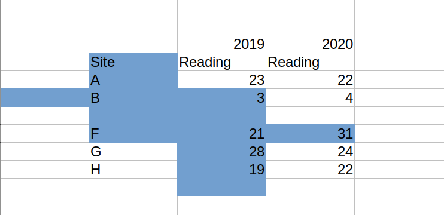

```{r setup, include=FALSE}
options(htmltools.dir.version = FALSE)
knitr::opts_chunk$set(
  fig.width=9, fig.height=3.5, fig.retina=3,
  out.width = "100%",
  cache = FALSE,
  echo = TRUE,
  message = FALSE, 
  warning = FALSE,
  hiline = TRUE
)
library(fontawesome)
library(gt)
library(dplyr)
library(tidyr)
```

```{r xaringan-themer, include=FALSE, warning=FALSE}
library(xaringanthemer)
style_duo_accent(
  primary_color = "#1381B0",
  secondary_color = "#FF961C",
  inverse_header_color = "#FFFFFF",
  inverse_background_color = "#8d99ae",
  base_font_size = "25px",
  text_font_size=  "1.25rem",
  link_decoration = "underline dotted red",
  code_font_size = "1.25rem",
  code_inline_color= "#003049",
  code_inline_background_color = "#FFFCFE",
  blockquote_left_border_color = "#003049"
  )

```

```{r xaringan-tachyons, echo=FALSE}
library(xaringanExtra)
xaringanExtra::use_tachyons()
```

```{r xaringan-panelset, echo=FALSE, eval=TRUE}
xaringanExtra::use_panelset()
```

```{r xaringan-animate-all, echo=FALSE, eval=TRUE}
xaringanExtra::use_animate_all("fade")
```

```{r xaringan-extra-styles, eval=TRUE, echo=FALSE}
xaringanExtra::use_extra_styles(
  hover_code_line = TRUE,     
)
```

```{css, echo = F}
.dk-section-title {
box-shadow: inset 0 0 0 1000px rgba(0,0,0,0.5);
}

.dk-section-title h1 {
  color: #f3f3f3;
  font-size: 100px;
  line-height: 1;
}

```

# Day 2

Unfinished business

.f3[
Organizing data

Principles of rectangular data

Tidy Data

Data Sharing

Tools for data rectangling (tidyverse-oriented)
]

---

## Unfinished business

.f3[
Disambiguate `here`  
- see slides for Day 1 

Loading data bundled with packages (and objects of type `promise`)
- we will do this for the excercises
]

---

class: dk-section-title
background-image:url("imgs/bsas.jpg")
background-size: cover

# Data organization

---

# Well-organized data


- Easier to import and manipulate

- Less prone to (non-replicable) errors 
  - omission 
  - alteration
  - duplication 

.f3[
Good data organization helps us when we produce data,
and also to identify and solve problems in existing data.
]

---

## Data Organization best practices 


.f3[

- Consistency in names, layouts, abbreviations, units, etc.

- Good names

- Make it rectangular
]


.pull-left[
Openscapes (2020)  
[Tidy data illustrated](https://www.openscapes.org/blog/2020/10/12/tidy-data/) 

.bg-yellow.b[
Broman and Woo (2018)  
[Organizing data in spreadsheets](https://doi.org/10.1080/00031305.2017.1375989)]

]

.pull-right[
Verde Arregoita et al. (2018)  
[Good practices for sharing analysis-ready data...](https://doi.org/10.4404/hystrix-00133-2018)

]

---

## Consistency

```{r birdnests, echo=FALSE, eval=TRUE, out.width="74%"}
knitr::include_graphics("imgs/consistency.png")
```
.tr[
Find the inconsistencies
]

---

## Data rectangles
.fl.w-30[
```{r, echo=FALSE, eval=TRUE, out.width="76%"}
knitr::include_graphics("imgs/rectangle1.png")
```
]

.fl.w-70[
Objects with rows and columns, in which:


- Each row has the same number of columns  

- Each column has the same number of rows  

_Vectors and factors of the same length = all columns must have the same 'height'_

Equal-height columns give a rectangular shape to the data frame
]

---

.fl.w-50[
```{r, echo=FALSE, eval=TRUE, out.width="50%"}
knitr::include_graphics("imgs/cashflow.png")
```

Davis Vaughan (2018)  
[Tidying Excel cash flow spreadsheets](
https://blog.davisvaughan.com/2018/02/16/tidying-excel-cash-flow-spreadsheets-in-r/)
]

.f3[
rectangular data ~  
a range of cells in a spreadsheet
]

```{r, echo=FALSE, eval=TRUE, out.width="50%"}

```

---

<blockquote class="twitter-tweet tw-align-center" data-conversation="none"><p lang="en" dir="ltr">but sometimes such data is “rectangular” in the same sense that this cat is “bowl-shaped” 😂 <a href="https://t.co/ZmxvgcV57d">pic.twitter.com/ZmxvgcV57d</a></p>&mdash; Jenny Bryan (@JennyBryan) <a href="https://twitter.com/JennyBryan/status/1126582138344595456?ref_src=twsrc%5Etfw">May 9, 2019</a></blockquote> <script async src="https://platform.twitter.com/widgets.js" charset="utf-8"></script> 

---

class: middle

```{r, echo=FALSE, eval=TRUE, fig.align='center',out.width="80%"}
knitr::include_graphics("imgs/transposed.png", error = FALSE)
```

---

class: center, middle, dk-section-title
background-image:url("imgs/peru.jpg")
background-size: cover
# Tidy Data and Data Rectangling

---

## Ready for immediate use?


- Subset, group, transform, sort, visualize, model, share


## Not ready?

- Restructure for easier and more effective handling

---

## Tidy data

An accessible reformulation of existing principles and definitions from statistics and computer science, to ultimately help us structure our data for maximum usability. 


- Arranged in a 2D data matrix with rows and columns 

- Rows correspond to observations   

- Columns correspond to variables

- One value per cell

.tr[
Wickham (2014)  
[Tidy Data](https://www.jstatsoft.org/article/view/v059i10/) - 
Journal of Statistical Software
]

---

```{r, echo=FALSE, eval=TRUE, fig.align='center',out.width="85%"}
knitr::include_graphics("imgs/varscols.png", error=FALSE)
```

---

```{r, echo=FALSE, eval=TRUE,out.width="70%", fig.align='center'}
knitr::include_graphics("imgs/tidydata.png", error=FALSE)
```

---

## Why tidy?

.fl.w-40[
Easy to reshape into other structures after cleaning or transforming
]    

```{r, echo=FALSE, eval=TRUE,out.width="42%"}
knitr::include_graphics("imgs/pivotingintro.gif", error=FALSE)
```

---

## Why tidy?

.f3[Row-wise operations]

Each value in an observation will be paired with other values that appear in the same row

```{r, echo=FALSE, eval=TRUE,out.width="60%", fig.align='center'}
knitr::include_graphics("imgs/discounts.png", error=FALSE)
```

---

class: middle

.fl.w-40[
```{r, echo=FALSE, eval=TRUE,out.width="85%", fig.align='left'}
knitr::include_graphics("imgs/tidyvarsmap.png", error=FALSE)
```
]

.fl.w-60[
.f3[
Variables feed directly into model specifications and plotting parameters.
]]

---

## Why not

.f3[
Tidy data -> more repetitive, often takes up more space than other more condensed representations


Not ideal for data entry, or for tables that will be embedded in a text document
]

---

class: center, middle, dk-section-title
background-image:url("imgs/trote.jpg")
background-size: cover
# Data organization quick tips

---

### Grouping information goes in its own variable.


Use indicator variables instead of encoding information into an existing value.


```{r, echo=FALSE, eval=TRUE, fig.align='center',out.width="90%"}
knitr::include_graphics("imgs/indgroups.png")
```

---

## NA and Empty Values

Not recorded, not applicable, lost in transcription, etc. 

.center.black.f2[Missing data are still data]

In R we use .red[`NA`], a special logical constant that denotes missing values 

---

class: middle 

- Code .red.b[`NA`] values consistently (if done consistently, blank cells are OK)

- Avoid ambiguity

> Are data known to be missing, or was a value intentionally left blank?

- Avoid empty cells as padding to align values, or for aesthetic or layout purposes.

- Avoid .red.b[`NA`] values in column headers

---

```{r, echo=FALSE, eval=TRUE, fig.align='center',out.width="55%"}
knitr::include_graphics("imgs/NAblank.png")
```

---

## Make reasonable headers (column names)

uninformative names with inconsistent naming schemes  

```{r, echo=FALSE, eval=TRUE}
useless <- tibble::tribble(
  ~X, ~X1, ~X2, ~min_Score, ~AVERAGE.SCORE,
  "UMN", "EAST", "A", 7.7, 7.701,
  "UV", "WEST", "B", 8.9, 8.89,
  "UNLV", "EAST", "C", 9.2, 9.199
)
useless %>%
  gt() %>%
  tab_style(
    cell_text(size = "25px"),
    locations = list(
      cells_body(),
      cells_column_labels(everything()),
      cells_title()
    )
  )
```


- More difficult to remember and specify  

- Do not sort well  

---

.f3[Much better]

```{r, echo=FALSE, eval=TRUE}
useless <- tibble::tribble(
  ~university, ~coast, ~division, ~min_score, ~avg_score,
  "UMN", "EAST", "A", 7.7, 7.701,
  "UV", "WEST", "B", 8.9, 8.89,
  "UNLV", "EAST", "C", 9.2, 9.199
)
useless %>%
  gt() %>%
  tab_style(
    cell_text(size = "25px"),
    locations = list(
      cells_body(),
      cells_column_labels(everything()),
      cells_title()
    )
  )
```

---
class: middle
### Names broken across rows

.pull-left[

```{r, echo=FALSE, eval=TRUE}
tibble::tribble(
  ~X, ~X1, ~X2, ~min, ~AVERAGE,
  NA, NA, NA, "Score", "SCORE",
  "UMN", "EAST", "A", "7.7", "7.701",
  "UV", "WEST", "B", "8.9", "8.89",
  "UNLV", "EAST", "C", "9.2", "9.199"
) %>%
  gt(useless) %>%
  tab_style(
    cell_text(size = "24px"),
    locations = list(
      cells_body(),
      cells_column_labels(everything()),
      cells_title()
    )
  )
```
]


.pull-right.f3[
Variable names appear in >1 rows  

Header fragments mixed with data

Separators become implicit  

`NAs` introduced
]

---
class: center, middle, dk-section-title
background-image:url("imgs/brigalow.jpg")
background-size: cover
# Data Sharing Best Practices

---

## Data can be intuitive, easy to read AND machine-readable if shared adequately

.f3[
↘️ Reduce the need for complex/proprietary software or advanced programming skills for inclusion in future analyses.


↘ Minimize the amount of interpretation that others (or future you) will need to make to use the data.
]

---

## File formats

.f3[
- Avoid PDF as a data format


- The simpler the better (prefer delimited text files such as CSVs)  

- Share data-only files, keep calculations and results elsewhere
]
---
class: dk-section-title
background-image:url("imgs/trote.jpg")
background-size: cover

# Tools for data rectangling

---

class: inverse

## Project setup

.f3.white[

- Create a new RStudio Project for this course

- Name the project "`gtmor`" and save it somewhere accessible (e.g. the Desktop)  

- Create the following folders in your working directory:
  - R
  - Out  
  - Data
]

---
class: inverse

## Project setup (continued)

.f3.white[
- Make sure you have `dplyr` installed

- Install the '`openintro`' package from CRAN
  `install.packages("openintro")`

- Get a drink or some snacks
]

---
class: center, middle, dk-section-title
background-image:url("imgs/scl.jpg")
background-size: cover
# Data manipulation tools
---

### Tools for preparing, transforming, and restructuring data

.fl.w-40[
.tc.f3[
📦 .b[`dplyr`]  
📦 .b[`tidyr`]  
]]

.fl.w-60[
Flexible, but developed around built-in features that support a particular way of doing things  

]    

<br/><br/><br/><br/><br/><br/>
- Hard to use incorrectly by accident   
- Less code to achieve a goal  
- Shared grammar and input/output data structures  
- Tasks split up across functions and packages
- Imports pipes

---

## Useful 📦 .b.red[`dplyr`] functions


- Individual functions for the most common operations


- Each function does one only thing, but does it well  


- Intuitive, user-friendly functions for common data manipulation tasks:

  - Subset columns

  - Subset rows

  - Create or modify columns  

---

```{r, echo=FALSE, eval=TRUE}
sneakers <- 
tibble::tribble(
           ~Name,       ~Sport, ~Price, ~Rating,
    "Boost 3000",    "Running",    99L,      4L,
       "HiSpeed",    "Running",    44L,      4L,
        "Super2",      "Trail",   100L,      5L,
          "Goal",   "Football",   119L,      3L,
       "Goal2.0",   "Football",    79L,      4L,
   "Airball Max", "Basketball",    49L,      4L,
    "Glide Best",    "Running",    55L,      5L,
  "Outdoor King",      "Trail",   160L,      5L,
          "G90x",   "Football",   120L,      4L,
     "Smith Pro",    "Running",    89L,      4L,
    "Travel Low", "Basketball",    89L,      3L
  )


```

.panelset[
.panel[.panel-name[sneakers]
```{r, echo=FALSE, eval=TRUE}
sneakers %>% gt() %>% 
  tab_style(
    cell_text(size = '21px'),
    locations = list(cells_body(),
                     cells_column_labels(everything()),
                     cells_title()))
```
]

.panel[.panel-name[Data setup]
```{r panel-chunk, fig.show='hide'}
sneakers <- tibble::tribble(
           ~Name,       ~Sport, ~Price, ~Rating,
    "Boost 3000",    "Running",    99L,      4L,
       "HiSpeed",    "Running",    44L,      4L,
        "Super2",      "Trail",   100L,      5L,
          "Goal",   "Football",   119L,      3L,
       "Goal2.0",   "Football",    79L,      4L,
   "Airball Max", "Basketball",    49L,      4L,
    "Glide Best",    "Running",    55L,      5L,
  "Outdoor King",      "Trail",   160L,      5L,
          "G90x",   "Football",   120L,      4L,
     "Smith Pro",    "Running",    89L,      4L,
    "Travel Low", "Basketball",    89L,      3L)

```
]
]

---

.left-column[
.f3.b[`select()`]
.f3[Subset variables]

- by name  
- by position  
- by type  
]

.right-column[
```{r}
sneakers %>% 
  select(Name, Sport) %>% 
  head(4)
```
]

---
.left-column[
.f3.b[`mutate()`]
.f3[Create and modify columns]

- create new  
- overwrite  
]

.right-column[
```{r}
sneakers %>%
  select(Name, Rating) %>% 
  mutate(Rating= Rating*2) %>% 
  head(5)
```
]

---

.left-column[
.f3.b[`filter()`]
.f3[subset rows]

- keep rows that meet a condition
]

.right-column[
```{r}
sneakers %>% 
  select(Name, Sport, Rating) %>% 
  filter(Rating == 5)
```

]

---

## Pre-exercise warmup - Loading package data

.f2.b.blue[`data()`] .f2[loads or lists available datasets]

<br/>

.f3.b.blue[`data()`] .f3[with no arguments shows every dataset currently available]

---

## Pre-exercise warmup - Loading package data

.f3[We can also specify which package we want to examine for bundled data:

.center[`data(package="ggplot2")`]

.center[`data(package="datasets")`]

.center[`data(package="tidyr")`]
]

---

## Pre-exercise warmup - Loading package data


.f3[We can use `data()` to load a particular dataset from a package (quoted or unquoted both work)]

> Load the relevant package first!

```{r, eval=FALSE}
library(ggplot2)
data(economics)

library(openintro)
data("nba_players_19")
```

---

```{r, eval=FALSE}
library(openintro)
data("nba_players_19")
```

.f3[
The dataset will appear in the global environment, first as an objet of type `promise` and then as a data frame once we evaluate it (use it in any way)]

---

# Bonus

Explore 1,745 bundled datasets across dozens of packages interactively 

.b[RDatasets] by Vincent Arel-Bundock 

https://vincentarelbundock.github.io/Rdatasets/articles/data.html

---
class: inverse

## Practice

- Load the `fastfood` data bundled with `openintro`

- Subset the data to keep only the `restaurant`, `item`, and `cholesterol` columns  

- Keep only the variables that include information about fat or vitamin content

- Which items have values of `calories` > 300 ?

- Create a new column that contains the values of `total_fat` multiplied by the square root of `calories`


---

class: center, middle, dk-section-title
background-image:url("imgs/scl.jpg")
background-size: cover

# Working `across()` multiple columns


---

## Operating on multiple columns

### .center.b.f2.red[`across()`]


.f3[
`filter` or `mutate` multiple columns simultaneously


- By position (not recommended), name, or type  

- Compound selections of columns  
(e.g. _factor columns that contain "month" in their name_)
]

---

## .b.red[`across()`] arguments:


.f2.b.green[`.cols`] Columns to transform

.f2.b.pink[`.fns`]  Function to apply to each of the selected columns  

> Expects a function, so function name and arguments can be passed separately

---

```{r}
sneakers %>% 
  mutate(across(c(Price, Rating), `*`, 2)) %>% 
  head(3)
```

- `.cols`  is a vector with the names of the two columns we're interested in

- `*` is the function to apply, `2` is the function argument

---

## Useful column selection helpers


.f3[To specify sets of columns, there are a number of useful helper functions that we can use alongside or instead of the `across` function.] 

.center.f3[
[`dplyr` selection features and helpers](
https://dplyr.tidyverse.org/reference/dplyr_tidy_select.html)
]

---

<br/>
.ba.ph4[
.b.red[`everything()`] Match all variables
]

```{r}
sneakers %>% 
  mutate(across(everything(), as.character)) %>% head(3)
```


---

.ba.ph4[
.b.red[`!`] Take the complement of a set of variables (negate a selection)
]

```{r}
sneakers %>% 
  select(!c(Sport,Price)) %>% head()
```


---

.ba.ph4.mt1.mb1[
.b.red[`where()`] Selects variables for which a predicate function returns `TRUE`  
> e.g. subset or transform all numeric variables, determined by `is.numeric()`]

```{r}
sneakers %>% 
  mutate(across(where(is.numeric), log2)) %>% slice(1:3)
```

---

.ba.ph3[
.b.orange[`matches()`] Match variable names with a regular expression
> e.g. drop variables with numbers in their name
]

```{r}
sneakers %>% 
  mutate(across(matches("Rat"), log2)) %>% head
```

---

.ba.ph3[
.center[
.b.red[`:`] Select a range of consecutive variables]
]

```{r}
sneakers %>% 
  select(Name:Price) %>% head
```

---

.ba.ph4[
.b.orange[`-`]   Exclude variables   
(return all elements except the one preceded by the subtraction operator)
]
```{r}
sneakers %>% 
  select(-Sport)
```


---

Square root (.red.b[`sqrt()`]) of `Price` and `Rating`

```{r, eval=TRUE}
sneakers %>%  
  mutate(across(c(Price, Rating), sqrt)) %>% 
  head()
```

---

### Square root (.orange.b[`sqrt()`]) of all numeric variables

```{r, eval=TRUE}
sneakers %>% 
  mutate(across(where(is.numeric), sqrt)) %>% 
  head
```

---

class: inverse
## Practice

- Load the `openintro::fastfood` data

- Open the shared document

---

class: center, middle, dk-section-title
background-image:url("images/trote.jpg")
background-size: cover
# Pivoting Data


---

.pull-left[
### Wide Data
Human-readable  
Easier entry  
Easier interactive editing
]
.pull.right[
### Long Data
Often meets Tidy Data principles  
Analysis-ready  
Maps well to plot axes and aesthetics ]


---

# Reshaping data with 📦 .b.red[`tidyr`]


.f3[wide to long: .b.red[`pivot_longer()`]]  

```{r, eval=FALSE}
pivot_longer(data, cols, names_to, values_to)
```


.f3[long to wide: .b.red[`pivot_wider()`]] 

```{r, eval=FALSE}
pivot_longer(data, cols, names_from, values_from)
```

---

```{r, echo=FALSE, eval=TRUE}
dining <- 
tibble::tribble(
     ~area_type, ~district, ~coffee_shops, ~fast_food, ~fish_chips,
  "Residential",   "South",            2L,         3L,          1L,
   "Commercial",   "North",           12L,         6L,          4L,
     "Suburban",   "South",            2L,         4L,          3L,
        "Rural",    "East",            0L,         2L,          0L
  )

```

.panelset[
.panel[.panel-name[dining]
```{r, echo=FALSE, eval=TRUE}
dining %>% gt() %>% 
    tab_style(
    cell_text(size = '24px'),
    locations = list(cells_body(),
                     cells_column_labels(everything()),
                     cells_title())) %>% 
  tab_options(table.background.color="#f4f4f9")
```
]

.panel[.panel-name[Data setup]
```{r panel-chunk-dining, fig.show='hide'}
dining <- 
tibble::tribble(
     ~area_type, ~district, ~coffee_shops, ~fast_food, ~fish_chips,
  "Residential",   "South",            2L,         3L,          1L,
   "Commercial",   "North",           12L,         6L,          4L,
     "Suburban",   "South",            2L,         4L,          3L,
        "Rural",    "East",            0L,         2L,          0L
  )
```
]
]

.center[Variables (attributes measured):]
.fl.w-24[
area type
]

.fl.w-25.tc[
district
]

.fl.w-25.tc[
type of resturant
]

.fl.w-25.tr[
number of restaurants
]

---

## Wide to long

```{r}
dining_long <- dining %>%
  pivot_longer(
    cols = c(coffee_shops, fast_food, fish_chips),
    names_to = "restaurant_type",
    values_to = "n_restaurants")
```

```{r, echo=FALSE, eval=TRUE}
dining_long <- dining %>%
  pivot_longer(
    cols = c(coffee_shops, fast_food, fish_chips),
    names_to = "restaurant_type",
    values_to = "n_restaurants")
```


**`cols`** Which columns have data in their names  


**`names_to`** Name for the new column to be created from `cols`  


**`values_to`** Name of the column to be created from the contents of the cells in **`cols`**  

---
class: middle

```{r, eval=FALSE}
dining %>%
  pivot_longer(
    cols = c(coffee_shops, fast_food, fish_chips),
    names_to = "restaurant_type",
    values_to = "n_restaurants")
```

---

```{r, eval=TRUE, echo=FALSE}
dining %>%
  pivot_longer(
    cols = c(coffee_shops, fast_food, fish_chips),
    names_to = "restaurant_type",
    values_to = "n_restaurants")
```


---

## Long to wide

```{r, eval=FALSE}
dining_long %>% 
  pivot_wider(names_from = restaurant_type, 
              values_from = n_restaurants)
```


.b[`names_from`] Which columns' values will be used for new .b[column names]

.b[`values_from`] Which column has the .b[cell values] for the new output columns

---

```{r, eval=TRUE}
dining_long %>% 
  pivot_wider(names_from = restaurant_type, 
              values_from = n_restaurants)
```


---

class: inverse
# Practice

- .f3[Load the "`gene_expression.csv`" file]
  - This table contains made up gene expression values (arbitrary units) for five different fish measured at six time points and sampled from two tissues.

- .f3[Pivot the data (wide to long and back to wide)]

---

# Other useful functions 


.f3[**`coalesce()`** - combine data, keeping values from one column and filling any missing data with values from other columns

**`fill()`** adjacent values. Helps us avoid unnecessary `NA` values and ambiguity. Similar logic to filling adjacent values in spreadsheets]

---

.b.red.f2[`dplyr::coalesce()`]  

.f3[
- Find and return the first non-NA value at each position for a set of vectors  
  
\* _columns in rectangular data are also vectors_


- Returns a single vector with the non-NA values that appear first 
]
---

.b.red.f2[`dplyr::coalesce()`]  

```{r, eval=TRUE}
x <- c(1, 2, NA, NA, 5)
y <- c(NA, NA, 3, 4, 5)
z <- c(1, 4, 3, 5, 3)
```

Numeric vectors of the same length - some have missing values.

```{r, eval=TRUE}
coalesce(x, y, z)
```

The order of the arguments is important

---

```{r, eval=TRUE}
x <- c(1, 2, NA, NA, 5)
y <- c(NA, NA, 3, 4, 5)
z <- c(1, 4, 3, 5, 3)
```


```{r, eval=TRUE}
coalesce(z,x,y)
```

---

```{r, eval=TRUE, echo=FALSE}
hotels <- 
tibble::tribble(
        ~location,        ~guest,        ~critic,        ~old,
         "Lisbon",            NA,            4.9,         2.6,
          "Porto",           2.2,             NA,         4.3,
          "Moura",           4.5,              5,         3.4,
         "Chaves",            NA,            2.7,         3.5,
        "Coimbra",           2.5,             NA,         2.3
  )

```

.panelset[
.panel[.panel-name[hotels]
```{r, echo=FALSE, eval=TRUE}
hotels %>% gt() %>% 
    tab_style(
    cell_text(size = '25px'),
    locations = list(cells_body(),
                     cells_column_labels(everything()),
                     cells_title())) %>% 
  tab_options(table.background.color="#f4f4f9")
```
]

.panel[.panel-name[Data setup]
```{r panel-chunk-hotels, fig.show='hide'}
hotels <- 
tibble::tribble(
        ~location,        ~guest,        ~critic,        ~old,
         "Lisbon",            NA,            4.9,         2.6,
          "Porto",           2.2,             NA,         4.3,
          "Moura",           4.5,              5,         3.4,
         "Chaves",            NA,            2.7,         3.5,
        "Coimbra",           2.5,             NA,         2.3
  )
```
]
]

---

</br>

```{r, eval=TRUE}
hotels %>% 
  mutate(new_rating = coalesce(guest, critic, old))
  
```

---

.f2.b.red[`tidyr::fill()`]  


```{r, echo=FALSE, eval=TRUE}
mammal_carbon <- tibble(mammals=c("cattle",NA,NA,NA,NA,"wild",NA,NA,NA),
       biomass=c(21,5,7,23,74,23,65,12,5))
```

.fl.w-40[
```{r, eval=TRUE, echo=FALSE}
mammal_carbon %>% gt() %>% 
    tab_style(
    cell_text(size = '21px'),
    locations = list(cells_body(),
                     cells_column_labels(everything()),
                     cells_title())) %>% 
  tab_options(table.background.color="#f4f4f9")
```
]


.f3[- Fill missing values in a column (top to bottom by default)   

- Contiguous/adjacent values assumed to be the same   

- Values only appear when they change along a column

- Stops at the next non-missing value] 

---
.pull-left[
```{r eval = TRUE}
mammal_carbon
```
]

.pull-right[
```{r, eval=TRUE}
mammal_carbon %>% 
  fill(mammals)
```
]
