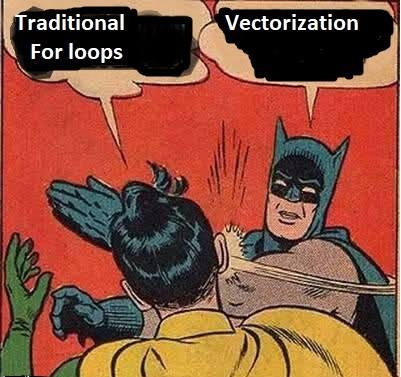

```{r setup, include=FALSE}
options(htmltools.dir.version = FALSE)
knitr::opts_chunk$set(
  fig.width=9, fig.height=3.5, fig.retina=3,
  out.width = "100%",
  cache = FALSE,
  echo = TRUE,
  message = FALSE, 
  warning = FALSE,
  hiline = TRUE
)
library(fontawesome)
library(gt)
library(dplyr)
library(tidyr)
library(ggplot2)
library(stringr)
library(palmerpenguins)
```

```{r xaringan-themer, include=FALSE, warning=FALSE}
library(xaringanthemer)
style_duo_accent(
  primary_color = "#1381B0",
  secondary_color = "#FF961C",
  inverse_header_color = "#FFFFFF",
  inverse_background_color = "#8d99ae",
  base_font_size = "25px",
  text_font_size=  "1.25rem",
  link_decoration = "underline dotted red",
  code_font_size = "1.25rem",
  code_inline_color= "#003049",
  code_inline_background_color = "#FFFCFE",
  blockquote_left_border_color = "#003049"
  )

```

```{r xaringan-tachyons, echo=FALSE}
library(xaringanExtra)
xaringanExtra::use_tachyons()
```
```{r xaringanExtra-clipboard, echo=FALSE}
xaringanExtra::use_clipboard()
```

```{r xaringan-panelset, echo=FALSE, eval=TRUE}
xaringanExtra::use_panelset()
```

```{r xaringan-animate-all, echo=FALSE, eval=TRUE}
xaringanExtra::use_animate_all("fade")
```

```{r xaringan-extra-styles, eval=TRUE, echo=FALSE}
xaringanExtra::use_extra_styles(
  hover_code_line = TRUE,     
)
```

```{css, echo = F}
.dk-section-title {
box-shadow: inset 0 0 0 1000px rgba(0,0,0,0.5);
}

.dk-section-title h1 {
  color: #f3f3f3;
  font-size: 100px;
  line-height: 1;
}

.smallcode .remark-code { /*Change made here*/
  font-size: 75% !important;
}

.tinycode .remark-code { /*Change made here*/
  font-size: 50% !important;
}

```

## Wednesday - Increasing efficiency

- Iteration, writing loops and using {`purrr`}

  - Apply functions to many things at once

  - Reading many files at once

  - Modifying and exporting multiple objects

- ~~Useful addins and helpers~~

- Regular expressions for working with text strings 

---

class: inverse

# Challenge

.f3.white[
" `Airports.csv`" contains yearly rankings for total number of passengers at the world's busiest airports across several countries between 2016-2020.


1. Find the busiest (highest ranked) airports for each country and year .f4[(some countries have multiple entries per year)]

2. Which countries had >1 different busiest airports (by airport code) in the time period covered by the data? 
]

---

```{r, eval=FALSE}

china <-  airports[airports$Country=="China",]
china_years <- china$Year

china2016 <- china[china$Year==2016,] 
china2016busiest <- 
  china2016[which(china2016$Rank==min(china2016$Rank)),]

china2017 <- china[china$Year==2017,] 
china2017busiest <- 
  china2017[which(china2017$Rank==min(china2017$Rank)),]

china2018 <- china[china$Year==2018,] 
china2018busiest <- 
  china2018[which(china2018$Rank==min(china2018$Rank)),]

```

---

## Iteration - perform a process repeatedly

Any time we copy and paste code, and then edit, we are adding unnecessary steps that add room for errors

.tr[
Nick Holt (2017)  
[Function Iterations in R](https://nick-holt.github.io/2017/12/function-iterations-in-r/)
]


---

## Grouped data

.f3[Most data analysis and manipulations tasks can be approached using the .b.purple[“split-apply-combine”] paradigm:] 

.f3[
- split the data into groups
- apply some analysis to each group
- combine the results
]

.tr[
Data Carpentry (2018)  
[Aggregating and analyzing data with dplyr](https://datacarpentry.org/R-genomics/04-dplyr.html)  

Hadley Wickham (2011)  
[The split-apply-combine strategy for data analysis](https://doi.org/10.18637/jss.v040.i01) 
]

---

.f2.code[.b.blue[`dplyr::`].red.b[`group_by()`]]

.f4[
- Define groups with one or more variables  
- Stratify a data frame 
- equivalent to `aggregate()` and the '`by = `' argument in .b[`data.table`]
]

.center[
    
]
from: Manipulación de datos en R con dplyr - Rubén Sánchez"

---

## Aggregating or manipulating grouped data

.f3[
Once `group_by()` creates a "grouped" version of a table, `dplyr` functions will manipulate each "group" separately and then combine the results. 
]

.bottom[
.tr[
RStudio (2021)  
[Data transformation with dplyr cheatsheet](
https://raw.githubusercontent.com/rstudio/cheatsheets/main/data-transformation.pdf)
]
]

---

### Within groups, we can:

.f3[
- summarize group values (mean, median)

- extract the first or last _n_ rows from each group

- find the minimum or maximum values

- remove duplicated rows

- count records, etc.]

---

```{r, eval=FALSE}
head(msleep)
```

```{r, echo=FALSE}
msleep %>% head %>% gt() %>% 
  tab_style(
    cell_text(size = '21px'),
    locations = list(cells_body(),
                     cells_column_labels(everything()),
                     cells_title()))
```

---

### maximum `brainwt` for each order

```{r, eval=FALSE}
msleep %>% group_by(order) %>% slice_max(brainwt,n=1)
```

.tinycode[
```{r, echo=FALSE}
msleep %>% group_by(order) %>% slice_max(brainwt,n=1)
```
]

---

### one row sampled randomly from each order
```{r, eval=FALSE}
msleep %>% group_by(order) %>% slice_sample(n=1)
```

.tinycode[
```{r, echo=FALSE}
msleep %>% group_by(order) %>% slice_sample(n=1)
```
]

---
.f3.b.blue[summarize]
```{r, eval=FALSE}
msleep %>% group_by(order) %>% 
  summarize(mean_slp = mean(sleep_total),
            mean_brainwt=mean(brainwt))
```
.center[
.tinycode[
```{r, echo=FALSE}
msleep %>% group_by(order) %>% 
  summarize(mean_slp = mean(sleep_total), mean_brainwt=mean(brainwt))
```
]
]
---

# Loops are fine

.f3[(and most of the time you don't have to write them yourselves anyway)]

.left-column[
   
]

.tr[
Jenny Bryan  
[purrr tutorial](https://jennybc.github.io/purrr-tutorial/index.html)  
[Data Rectangling](https://speakerdeck.com/jennybc/data-rectangling)  
[purrr workshop](https://speakerdeck.com/jennybc/purrr-workshop)
]

---

## For loops

.pull-left[
```{r, eval=FALSE}
for (value in sequence) {
   statement(s)
}
```

 
Execute a set of _statements_, once for each item in a vector, array, list, etc. and stop when the last element is reached. 
]

.pull-right[
```{r}
for (x in 1:7) {
  print(x)
} 
```
]

---

## Loops and working with groups

```{r, eval=FALSE}
msleep %>% 
  group_by(order) %>%   # for order in orders
  slice_sample(1)       # statement to execute 
                        ## (sample element at random)
```

.f3[Similar to loops but we keep everything inside the data frame]

---

# Vectorization is our friend

Operations occur in parallel on all elements, rather than on individual components in sequence

.f3[What will be the result here?]

```{r, eval=FALSE}
x <- c(1,3,12,4,7,8)
x > 5
```

---

### Logical operators are vectorized (many other fns too!)

```{r, eval=TRUE}
x <- c(1,3,12,4,7,8)
x > 5
```

We don't need to type all of this out or a loop
```{r, eval=FALSE}
x[1]>5 ; x[2]>5
x[3]>5 ; x[4]>5
x[5]>5 ; x[6]>5
```

---

.center[
   
]
.center.f4[American Greetings]
---

# If we really need to iterate
.left-column[
```{r, echo=FALSE, eval=TRUE, out.width="90%", fig.align='center'}
knitr::include_graphics("imgs/purrr.jpeg")
```
]

.right-column[
.f3[
📦 **`purrr`** - Functional programming tools

- map functions to data  
- work efficiently with **lists**
- readable code
]
]

.tr[
Thomas Mock (2018)  
[Functional Programming in R with purrr](https://towardsdatascience.com/functional-programming-in-r-with-purrr-469e597d0229)
]

---

class: middle

.f1.code.center[
map(.red.b[.x], .green.b[.f], ...)
]

.f2[for every element of .red.b.code[.x]

apply .b.green.code[.f]

...  arguments for .green.b.code[.f]
]


---

## Mapping functions to data
.center[`map(.x,.f)`]

.f2[We can specify .green.b.code[.f] as:]

.f3[
- an existing function  

- an anonymous function, defined on-the-fly

- a formula: unique to `purrr`,  provides a very concise way to define anonymous functions
]

---

## Functions

```{r, echo=FALSE, eval=TRUE, out.width="80%", fig.align='center'}
knitr::include_graphics("imgs/r-function-syntax.png")
```
https://www.learnbyexample.org/r-functions/

---

.b.blue.f2[Function Definition] - The '`function()`' function

.f2.center[`function( arglist ) expr`]

.f3[
**arguments** (`arglist`): values passed to the function

**expression** `(expr)`: 
an object that represents an action that can be performed by R. .b[Expressions contain one or more statements]
]

---

## Defining a function 

```{r}
my_custom_function <- function(my_arg){
  x+1 # statement
}

my_vector <- c(3,5,6,7)

my_custom_function(my_arg = my_vector)

```


---

.f3[The body of the function –the statements that are executed when it runs– is grouped with curly braces   (`{}`)]

```{r}
f <- function(x) {
  x + 4 # statement
}
```

.left-column[
.smallercode[
```{r}
f(6)
f(x=6)
```
]]

.right-column[
Writing the names of arguments in a function call is optional, but for functions with >1 arguments the order of the argument values matters]

---

.f3[**But** we _don't_ need curly braces for functions with only one statement]

```{r}
f <- function(x) x+4   
f(x=6)
```

```{r}
f <- function(x) mean(x)/2   
f(c(6,43,12,5,7))
```

---

.f3[Enclose multi-statement function bodies in curly braces]
```{r, eval=FALSE}
f <- function(x)  y <- (x*0.2885) log(y) # WON'T RUN  
```

.f3[Works, note the statements in separate lines]
```{r}
f <- function(x) {
  y <- (x*0.2885) # this is a statement
  log(y)          # this is another statement
}

f(5)
```

---

## Anonymous functions

.f3[Functions on the go
(created and used but never assigned to a variable)]

### Anonymous function syntax
```{r}
(function(x) x * x + 3)(10)
```

the function definition in anonymous functions needs to be wrapped in parentheses to separate function and arguments

---

```{r, eval=FALSE}
(function(x) x + 3)(10)
```

Behaves exactly the same as

```{r}
f <- function(x) x + 3
f(10)
# or 
f <- function(x) {x + 3}
f(10)

```

---

## Anonymous functions

.f3[
- Handy when we want to apply a user-defined operation to many things at once

- Also known as _lambda expressions_

- Self-contained

- Comparable with similar approaches in Python
]

---

## Why write our own functions

.f3[
- Avoids repetition

- Brevity

- Less room for errors

- Take advantage of tools that help us apply functions to many things at once
]

.tr[
Jenny Bryan - Stat545  
[Write your own R functions](https://stat545.com/functions-part1.html)
]

---

# Lists

.f3[Objects which contain elements of different types, such as numbers, strings, vectors, data frames, or even other lists]

```{r}
my_list <- list(
  a_number = 7,
  a_vector = c("mouse", "cat", "dog"),
  a_dataframe = data.frame(
    a = 1:3, b = c("K", "L", "M")))
```

.tr[
Rebecca Barter (2019)  
[Learn to purrr](https://www.rebeccabarter.com/blog/2019-08-19_purrr/)
]

---

```{r}
my_list
```

---

## List indexing
.center[
   
]
Hadley Wickam (2015) on [Twitter](https://twitter.com/hadleywickham/status/643381054758363136?s=20&t=0Gu4Qs757o5KHEJR2ZwkEg)

---

.f3[We can also create lists by splitting other objects]

Group and split with `dplyr` into a list of data frames, one for each group

```{r, eval=FALSE}
cars_country <- 
  gt::gtcars %>% group_by(ctry_origin) %>%
  group_split()
```

```{r, eval=TRUE, echo=FALSE, include=FALSE}
cars_country <- 
  gt::gtcars %>% group_by(ctry_origin) %>%
  group_split()
```

```{r}
class(cars_country)
```

---

.f3[`group_keys()` retrieves the grouping data]

```{r}
gt::gtcars %>% group_by(ctry_origin) %>%
  group_keys()
```

---

```{r}

cars_country[[1]] %>% 
  select(model,ctry_origin) %>% head

```

---

```{r}

cars_country[[2]] %>% 
  select(model,ctry_origin, hp, msrp) %>% 
  head

```

---

.center[
   
]
Luis (2017)
Export Iteratively  
https://luisdva.github.io/rstats/export-iteratively/

---

# Why lists?

- Flexible, can store many kinds of objects

- We can easily create lists by splitting existing objects

- List elements can be named 

---

## Mapping functions to data 

- Apply functions to many things at once

- Reading many files at once

- Modifying and exporting multiple objects

---

### Apply functions to many things at once
```{r, eval=FALSE}
library(openintro)
library(purrr)
data("starbucks")
# create three vectors (numeric)
fat <- starbucks$fat
carb <- starbucks$carb
protein <- starbucks$protein
# put them in a list
nutrients <- list(fat,carb,protein)
# apply the mean function to each list element
map(nutrients,mean)
```

---

### Apply (custom) functions to many things at once 

```{r, eval=FALSE}
# fn that gets min, max, and range

getMinMaxRange <- function(x){
  min_x <- min(x)
  max_x <- max(x)
  maxmin <- max_x - min_x
  c(min_x, max_x, maxmin)
}

```

---

### Check that the function works for vectors

```{r, eval=TRUE, echo=FALSE, include=FALSE}
library(openintro)
library(purrr)
data("starbucks")

# create three vectors (numeric)
fat <- starbucks$fat
carb <- starbucks$carb
protein <- starbucks$protein
# put them in a list
nutrients <- list(fat,carb,protein)
# apply the mean function to each list element
map(nutrients,mean)
# fn that gets min, max, and range

getMinMaxRange <- function(x){
  min_x <- min(x)
  max_x <- max(x)
  maxmin <- max_x - min_x
  c(min_x, max_x, maxmin)
}

```

```{r, eval=TRUE}
getMinMaxRange(protein)
getMinMaxRange(carb)
getMinMaxRange(fat)
```


---

### Use `map()` to apply the fn to all the list elements

```{r}
map(.x = nutrients, .f = getMinMaxRange)
```

---

## Type-specific `map()` 
.f3[
`map()` always returns lists  

`map_lgl()` returns a logical  

`map_int()` returns an integer vector  

`map_dbl()` returns a double vector

`map_chr()` returns a character vector

`map_df()` returns a data frame
]

---

```{r}
map(nutrients, median)
map_dbl(nutrients, median)

```
---

## What about anonymous functions and formulas?

.f3[Once we know how to define new functions, we can write anonymous functions to express what we want to do if we only need to do it once.]


.tr[Anonymous Functions in R - Part 1  
https://coolbutuseless.github.io/2019/03/13/anonymous-functions-in-r-part-1/]

---

## Anonymous functions and formulas

Same behavior
```{r, eval=FALSE}
numlist <- list(c(5:10),c(20:27))
# anonymous function
map(numlist, function(x) x+2)
# formula notation
map(numlist, ~ .x + 2)
```

---

.f2[In formula shorthand notation (defined with `~`) 
.b.code.red[.x] always refers to the element of the vector or list we are iterating on]

.f2[Behind the scenes .b.red[`~.x + 4`] becomes .b.red[`function(x) x+4`]]

---

# Reading or writing many files at once

.center.f2[`map(.x,.f)`]

.f2.red.b[`.x`] .f2[can be a list or vector of file paths]

.f2.green.b[`.f`] .f2[can be a function that reads or writes files]


---

class: inverse

### Let's create a directory full of text files

.f3.white[
- load `openintro` and make the `nba_players_19` data available

- group the data by `team` then use `group_split()` to create a list of data frames, one for each team

- create a vector of team names
]

> 😲 We can iterate over two inputs simultaneously

---

# Mapping w/ two inputs

.center.f2[`map2(.x, .y., .f)`]

.f3[Both input lists or vectors are passed to function .b[.f]]

.pull-left[
    
]
.pull-right[
Altman et al. (2021)  
[Map with multiple inputs](https://dcl-prog.stanford.edu/purrr-parallel.html)
 ]
 
---

class: inverse
## Creating a directory full of text files

.f3.white[
- Create the folder "nbateams" inside your "Data" folder

- Use `here()` to build file (safe and portable) paths for each team in the vector of team names

- Feed the list of data frames and the vector of file paths to `readr::write_csv`
 ]

.center[🔥🏀🔥]

---
class: inverse
## Reading many files at once

.f3.white[
- use `dir_ls()` to create a vector with the paths for your newly created csv files

- read each element of this vector with `map()` and `readr::read_csv()`

- BONUS CHALLENGE: type-specific mapping (putting everything into a data frame) will throw an error here. Why?
]


---
class: dk-section-title
background-image:url("imgs/peru.jpg")
background-size: cover

# Regular expressions and working with strings

---

# What are Regular Expressions?

- Also abbreviated as regex, R.E., or regexp (singular)  

- A concise language for describing patterns of text 

## Specially encoded 🧶.helvetica[_strings_] of characters that match patterns in other text strings 


---

## Regular expressions

.f3[
In practice, a computer language with its own terminologies and syntax

- Input as a text string that compiles into a mini program built specifically to identify a pattern. 

- Can be used to match, search, replace, or split text 
]
---

## 🧶Strings

.f3[
A collection of characters that make up one element of a vector:
]

```{r, eval=TRUE}
test_string <- "This sentence is a string."
```


.f3[
We can store multiple strings in a character vector:
]

```{r, eval=TRUE}
pets <-  c("dogs","cat","parrot","pig")
```


---

## Strings

.pull-left[
.f3[Headers and values in a data frame can also be strings:]]

```{r include=FALSE, eval=TRUE}
library(gt)
library(tibble)
library(magrittr)
drinks_df <- tibble(drink=c("Coffee","Tea","Juice"),price=c(3.50,2.99,3.20))
```

.pull-right[
```{r echo=FALSE, eval=TRUE}
drinks_df %>%
  gt() %>%
  tab_style(
    style = list(
      cell_fill(color = "yellow")
    ),
    locations = cells_body(
      columns = vars(drink)
    )
  ) %>%
  tab_options(column_labels.background.color = "yellow")
```
]


<br/>
> Remember how we matched patterns in column names when working with `select()` and the `matches()` selection helper

---

## Strings in R are _case sensitive_

Uppercase and lowercase letters are treated as distinct


```{r, eval=TRUE}
"rat"=="rat"
```


```{r, eval=TRUE}
"rat"=="rAT"
```


---

### Regex searches are case sensitive by default

Our options:   

.f3[
- Build case-insensitive regular expressions  

- Turn off case sensitivity in the matching, 

- Modify the input text before matching. 
]

---
## Why Learn Regular Expressions?

.f3[
- Writing regular expressions <- underutilized, valuable skill 

- Save  time when we need to match, extract, or transform text by matching words, characters, and patterns

- Regular expressions can often **replace dozens of lines of code**

- Not specific to any particular programming language or command-line tool
]

---

## Getting started

.fl.w-third[
<div class="f2 mt1 pt0 code">Regexp</div>
</br>
]

.fl.w-third[
<div class="f2 mt0 pt0 code">Input string</div>
</br>
]

.fl.w-third[
<div class="f2 mt0 pt0 code">Match</div>
</br>
]
</br>

</br></br>


The matching is done by the regex engine. We do not access the engine directly, but functions that take regular expressions as arguments call on it whenever its needed.

---

## Getting started


.fl.w-third[
<div class="f2 mt1 pt0 code">Regexp</div>
</br>
`dog`
]

.fl.w-third[
<div class="f2 mt0 pt0 code">Input string</div>
</br>
"The dog is fat."
]

.fl.w-third[
<div class="f2 mt0 pt0 code">Match</div>
</br>
The .bg-yellow[dog] is fat.

]
</br></br></br></br></br>
.f3[
To search for a specific sequence of characters, the regexp (regular expression) we need is simply that sequence of characters]


> find a **d** followed by an **o** followed by a g. (all characters together and in that order when read from left to right)

---

## Online regex testers
.f3[Is the regular expression matching anything?]


- [rubular](https://rubular.com/) by Michael Lovitt  

- [regex101](https://regex101.com/) by Firas Dib 

- [regexr](https://regexr.com/) by Grant Skinner 

- [regexpal](https://www.regexpal.com/) - part of Dan's Developer Tools 

---

## Regex Testers

```{r, echo=FALSE, eval=TRUE, fig.align='left',out.width="100%"}
knitr::include_graphics("imgs/regextester.png")
```


---

class: inverse
## Practice

.f3.white[Navigate to [rubular](https://rubular.com/), [regex101](https://regex101.com/), [regexr](https://regexr.com/), or [regexpal](https://www.regexpal.com/)

Input the following text into the test string field: 
]

milk  
rice   
cereal  
salt  
soda  

.f3.white[Write regular expressions (one at a time) to match the things we can drink and look at the match results]


---

## Literal Characters and Metacharacters

.f2[
Strings and regular expressions are made of characters

For regular expressions, characters can be grouped into two classes depending on their behavior
]

---

## Literal characters

.f2[
If input string is **"dog"** and regex is .b.orange[dog]

We will get a match whenever the characters .orange[`d`], .orange[`o`], and .orange[`g`] occur consecutively in the input text]

--

`"dog"` tells the regex engine:
find a .orange[d], immediately followed by an .orange[o], immediately followed by a .orange[g] (.b[together and in that particular order])

---

## Literal characters (continued)

.f3[.orange[`d`], .orange[`o`], and .orange[`g`] are examples of literal characters]. 


.f2[They stand for exactly what they are: .orange[`d`] in the regex matches a “.purple.b[d]” in the input text, .orange[`o`]  matches an “.purple.b[o]” in text, and so on.]

---
class: middle

.f2[The power and flexibility of regular expressions comes from their ability to describe more complex patterns.


If a text pattern can be described verbally, we can most likely write regular expression to match it.]


---

### Possible patterns


- "dog" but not "dogs"  


- "dogs" but only if the match is at the start of the string,

- digits (0, 1, 2, 3, 4, 5, 6, 7, 8,  9)  


- "modeling" or "modelling"  (alternate spellings of the same word)


- words ending in "at" (words that begin or end with a specific pattern)

- strings that start with digits

- dates

---

### Possible patterns

- zip codes

- numbers inside square brackets and also the brackets  

- valid Twitter handles (start with @, no spaces or symbols, <16 characters)

- UPPERCASE words

---

## Metacharacters

.f3[To match more than literal strings of text, a small subset of characters that have special functionalities when they appear in a regular expression. Metacharacters do not stand for themselves, they interpreted in a special way.]

.f3[ 
Metacharacters include: .b.orange[[]\^$.|?*+()], which are reserved for unique matching purposes.
]


---

.f3[
.b[Wildcards] stand in for unknown characters  
]


&nbsp; .f1.orange.pre[&nbsp;.&nbsp; ] &nbsp;&nbsp; match any character once
***


.b.orange[f..l] matches ".b.bg-yellow[fill]" and ".b.bg-yellow[fool]", but not "flail"  


.b.orange[.top] matches ".b.bg-yellow[stop]" and "is.b.bg-yellow[otop]e", but not "topple"  


> note the substring match in "is**otop**e" 

---

.f3[
.b[Character sets] match one or more characters enclosed in square brackets 
]

&nbsp;.b.orange.pre[&nbsp;[ ] &nbsp;] &nbsp;&nbsp; match a set of characters  
***

.b.orange[[cb]at] matches ".b.bg-yellow[cat]", and ".b.bg-yellow[bat]", but not "rat"

.b.orange[[CK]at[iey]] matches ".b.bg-yellow[Caty]", ".b.bg-yellow[Kati]", ".b.bg-yellow[Katy]", and ".b.bg-yellow[Kate]"

---

.f3[
.b[Negation tokens]&nbsp;  
  
.orange.b[[^]] 	&nbsp;&nbsp; match characters not in the specified character set]

> `^` must be the first character inside the brackets

***


.b.orange[[^aoeiou]] matches consonants


.b.orange[[^R]] matches everything except capital R

---

.f3[
.b[Character ranges] indicate a series of sequential characters inside character sets 
]

Dash (.b.orange[\-]) inside a character set abbreviates alphabetical or numeric sequences 
***


.b.orange[[A-D]]  matches any single letter from A,B,C, or D (uppercase)


.b.orange[[5-8]]  &nbsp;matches any single digit between 5 and 8  

.b.orange[[A-Za-z]]  matches all alphabetical characters


> Character sets are case sensitive


> character ranges can also be negated with `^`

---

.f3[
.b[Anchors] specify the relative position of the pattern being matched   
]


&nbsp;.orange.f3.pre[&nbsp;^&nbsp;] &nbsp;&nbsp;     starts with  
&nbsp;.f3.orange.pre[&nbsp;$&nbsp;]  &nbsp;&nbsp; ends with  
.b.orange[`^`] outside a pair of square brackets is an anchor
***


.b.orange[^mil] matches ".b.bg-yellow[mil]kshake" but not "family"  

.b.orange[ing$] matches "go.b.bg-yellow[ing]" but not "ingest"  

> note the substring matches

---

class: inverse

### Practice
.f3.white[
- Write a regexp that can match **tail**, **tool**, **tall**, and **toil**  

- How can we match **Jocelyn**, **Jocelin**, and **Joselyn** but not Jozelyn using character sets?

.fl.w-third.pa0[.tc[
a) Joscel[iy]n
]]
.fl.w-third.pa0[.tc[
b) Jo[sc^z]el[yi]n
]]
.fl.w-third.pa0[.tc[
c) Jo[sc]el[yi]n
]]
]

---

class: inverse

.f3.white[
- Which of these regular expressions matches **`food`** at the beginning of a string?


.fl.w-25[.tl[
a) ^food
]]
.fl.w-25[.tl[
b) food
]]
.fl.w-25[.tl[
c) $food
]]
.fl.w-25[.tl[
d) food^
]]
]

---

.f3[**Quantifiers** specify how many times a character or character class must appear in the input for a match to be found]

&nbsp;.f2[.orange.f1[&nbsp;?&nbsp;] &nbsp;&nbsp;Zero or one ]  	
&nbsp;.f2[.orange.f1[&nbsp;\\\*&nbsp;] &nbsp;&nbsp;Zero or more occurrences] 	
&nbsp;.f2[.orange.f1[&nbsp;+&nbsp;]	 &nbsp;&nbsp;One or more occurrences]   
&nbsp;.f2[.orange.f1[&nbsp;{}] 	&nbsp;&nbsp;Exactly the specified number of occurrences]  	

> quantifiers apply to the preceding character

---

### Quantifiers


.b.orange[modell?ing] matches ".b.bg-yellow[modeling]" and ".b.bg-yellow[modelling]"  

> zero or one `els (l)`


.b.orange[ya*y!] matches ".b.bg-yellow[yy!]", ".b.bg-yellow[yay!]", ".b.bg-yellow[yaaay!]", ".b.bg-yellow[yaaaaaay!]", etc.

> zero or more `aes (a)`

---

### Quantifiers

.b.orange[no+] matches “.bg-yellow.b[no]”, “.bg-yellow.b[nooo]", ".bg-yellow.b[noooooo]", etc, but not “n”  

> one or more `oes (o)`


.b.orange[e{2}] matches .“k.b.purple.bg-yellow[ee]p” and “b.b.purple.bg-yellow[ee]" but not “meat” 

> exactly two `ees (e)`


---
class: inverse
## Practice

.f3.white[
- Use a quantifier to match **cute**, **cuuute**, **cuuuuuute**, and **cuuuuuuuuute**  

- How can we match Computer, computer, Computers, and computers?

.fl.w-third.pa0[.tc[
a) [cC]omputers?
]]
.fl.w-third.pa0[.tc[
b) Computers+
]]
.fl.w-third.pa0[.tc[
c) [cC]omputer[s]+
]]

]
---

.f3[
.b[Alternation] tokens separate a series of alternatives]  
.f3[.orange.b.pre[&nbsp;|&nbsp;] &nbsp;&nbsp; either or
]
***


.b.orange[dog|bird] matches ".b.purple.bg-yellow[dog]" or ".b.purple.bg-yellow[bird]"

.b.orange[gr(a|e)y] matches ".b.purple.bg-yellow[gray]" and ".b.purple.bg-yellow[grey]"
> note the alternation enclosed in brackets


---

.f3[
.b[Special sequences and escapes]<br>
.b.orange.pre[&nbsp;\\&nbsp;] 	&nbsp;&nbsp; signals a shorthand sequence or gives special characters a literal meaning
]

---

### Escapes
.b.orange[hello\\\\\\\\?] matches ".b.purple.bg-yellow[hello?]"

.f3[
> question mark treated as a literal character, but in R escape the backslash first
]


_Metacharacters inside a character set are stripped of their special nature_

---

.f3[.b[Shorthand sequences] are available to refer to commonly-used character sets
]

.b.orange[\w] &nbsp;letters, underscore, and numbers  <br>
.b.orange[\d] &nbsp;digits<br>
.orange.b[\t]  &nbsp;&nbsp; tab &nbsp;&nbsp;&nbsp;&nbsp;&nbsp;&nbsp;&nbsp;&nbsp;&nbsp;&nbsp;&nbsp;&nbsp;&nbsp;&nbsp;&nbsp;&nbsp;&nbsp;&nbsp;&nbsp;&nbsp; .orange.b[\n]  &nbsp; new line &nbsp; &nbsp;&nbsp;&nbsp;&nbsp;&nbsp;&nbsp;&nbsp;&nbsp;&nbsp; .orange.b[\s]  &nbsp;space<br>
.orange.b[\b]  &nbsp;word boundary<br>

>.small[Predefined character classes help us avoid malformed character sets]


---

### Word boundaries .b.orange[`\\b`]


Match **positions** between a _word_ character (letter, digit or underscore) and a non-word character (usually a space or the start/end of a string).
*** 

> Before a sequence of word characters

.b.orange[\\bcase] matches ".b.bg-yellow.purple[case]" and "two .b.bg-yellow.purple[case]s" but not "suitcase"  

> After a sequence of word characters

.b.orange[org\\b] matches "cyb.b.bg-yellow.purple[org] rebellion" but not "organic"


---

### _Word_ characters .b.orange[`\\w`]


Matches any character (letter, digit or underscore). Useful in combination with word boundaries and quantifiers.
***  


Equivalent to .orange[\[a-zA-Z0-9_\]]


.b.orange[\\w] matches letters (case insensitive), numbers, and underscores in:

.b.bg-yellow.purple[F33d].%.b.bg-yellow.purple[the_mÖusE] .b.bg-yellow.purple[pl]@.b.bg-yellow.purple[ase]!!# 


---

class: inverse
## Practice

.f3.white[
Enter "That athlete is at the squat rack" as the test string in a regex tester.

Explain the matches obtained with the following three regular expressions?
 
 a) at  
 b) \bat  
 c) at\b
]
---

## Anchor, wildcard with quantifier (0 or more)

.b.orange[^can.\\\*] matches ".b.purple.bg-yellow[can]", ".b.purple.bg-yellow[can]ine", ".b.purple.bg-yellow[can]oli", and ".b.purple.bg-yellow[can]adian"

##  Wildcard and quantifier
.b.orange[A.\\*x] strings that start with "**A**" and end with "**x**"

---

## Shorthand sequence (space) and quantifier

.b.orange[\\s{3}] matches three spaces 


## Anchors, character set, and quantifier (one or more) 

.b.orange[^[a-z]+$] matches a lowercase string


---

## Word characters, quantifiers, word boundaries, and anchors

.b.orange[\w+\b$] matches the last word in a string

"Fix the .b.purple.bg-yellow[car]."  
"12 .b.purple.bg-yellow[eggs]"

.b.orange[^\w+\b] matches the first word in a string

".b.purple.bg-yellow[Fix] the car."  
".b.purple.bg-yellow[12] eggs"


---

```{r, echo=FALSE, eval=TRUE, fig.align='center', out.width='66%'}
knitr::include_graphics("imgs/regular-expressions.svg")
```
</br>
.center.small[Modified from '[Regular Expressions](https://github.com/rstudio/concept-maps/#regular-expressions)' concept map by Greg Wilson]

---
class: inverse
## Practice

.f3.white[
Write regular expressions to match the following, making sure they work in an interactive regex tester:

1. strings with both letters and digits
2. strings ending in a period
3. lowercase strings
4. exactly four digits
5. strings without the letter _**s**_
]

---
class: center, middle, dk-section-title
background-image:url("imgs/bsas.jpg")
background-size: cover
# Regex in R

---

.f3[
We can match column names and values in `character` strings with regular expressions]


```{r, echo=FALSE, eval=TRUE, fig.align='center', out.width='95%'}
knitr::include_graphics("imgs/regexsubsetting.png")
```

---

# 📦 .red[`stringr`]

.f3[
Cohesive set of functions for string manipulation
]


- Function names start with .b[`str_`]   

- All functions take a vector of strings as the first argument (pipe-friendly)  


**`regex()`** modifier to control matching behavior

.content-box-gray[`ignore_case=TRUE` will make matches case insensitive]


---

## `stringr` examples


**Matches?**

```{r, eval=TRUE}
str_detect(string = c("catalog", "battlecat", "apple"), pattern = "cat")
```

Output is a logical, TRUE or FALSE vector of the same length as our input string

---

## `stringr` examples

**Which elements contain matches?**

```{r, eval=TRUE}
str_which(string = c("catalog", "battlecat", "apple"), pattern = "cat")
```

Output is the index for each of the matching elements

---

## `stringr` examples

**Replacing matches**

```{r, eval=TRUE}
str_replace(string = c("colour", "neighbour", "honour"),
            pattern = "ou",
            replacement = "o")
```


---

## `stringr` examples

**Case insensitive matching**

```{r, eval=FALSE}
str_replace(string = c("colOur", "neighboUr", "honOUr"),
            pattern = regex("ou", ignore_case = TRUE),   
            replacement = "o") 
```


---

## `stringr` examples

**Case insensitive matching**

```{r, eval=FALSE}
str_replace(string = c("colOur", "neighboUr", "honOUr"),
            pattern = regex("ou", ignore_case = TRUE),  #<< 
            replacement = "o") 
```


---

## `stringr` examples

**Case insensitive matching**

```{r, eval=FALSE}
str_replace(string = c("colOur", "neighboUr", "honOUr"),
            pattern = regex("ou", ignore_case = TRUE),  #<< 
            replacement = "o") 
```

```{r, eval=TRUE, echo=FALSE}
str_replace(string = c("colOur", "neighboUr", "honOUr"),
            pattern = regex("ou", ignore_case = TRUE),
            replacement = "o") 
```


---

class: inverse

## Practice

.f3[
Match these REs against the test vector below using `str_detect`.  Can you explain the matches?

Regular expressions
1. ^dog
2. ^[a-z]+$
3. \\\\d
]

```{r}
test_vector <- c("Those dogs are small.","dogs and cats",
                 "34","(34)","rat","watchdog","placemat",
                 "BABY","2011_April","mice")
```

---


---

## Using regular expressions in data manipulation


.f3[
Select, subset, keep, or discard rows and columns
]


.f3[   
Substitute or recode values
]


.f3[
Extract or remove substrings
]


---

## Cleaning data with regex

To select variables in 📦 .b.red[`dplyr`] and 📦 .b.red[`tidyr`], we:

- write out their names   

- refer to them by position  

- specify ranges of contiguous variables


- .f3[use 📦 .b.red[`tidyselect`] helper functions]

---

## 📦 .red.b[`tidyselect`] helpers


.b[`matches()`] takes regular expressions, and selects variables that match a given pattern


**`starts_with()`**: Starts with a prefix  


**`ends_with()`**: Ends with a suffix  


**`contains()`**: Contains a literal string 

---

## 📦 .red.b[`tidyselect`] helpers


.b[`matches()`] takes regular expressions, and selects variables that match a given pattern


.gray[
**`starts_with()`**: Starts with a prefix  
]

.gray[
**`ends_with()`**: Ends with a suffix  
]

.gray[
**`contains()`**: Contains a literal string 
]

---

### Selecting columns by name

`penguins` data from 📦 .red.b[`palmerpenguins`]

```{r, eval=TRUE}
names(penguins)
```

.tinycode[
```{r, eval=TRUE}
penguins %>% 
  select(species, bill_length_mm, flipper_length_mm) %>% sample_n(3)
```
]


---

### Selecting columns by matches in variable names

```{r, eval=TRUE}
penguins %>% 
  select(species, matches("length")) %>% 
  sample_n(3)
```

---

### Match values and filter rows


Mammals sleep dataset (`msleep`) from 📦 .red.b[`ggplot2`]

```{r, eval=FALSE}
library(ggplot2)
```

```{r, eval=TRUE}
msleep %>% select(name,genus) %>% sample_n(4)
```

---

### Match values and filter rows

Filter to keep rats only

```{r, eval=TRUE}
msleep %>% 
  select(name,genus) %>% 
  filter(str_detect(string = name,pattern = "rat"))
```

---

class: inverse

## Practice

.f3[🐀 After running the code below, how can we exclude muskrats from the matches?]

```{r, eval=FALSE}
msleep %>% 
  select(name,genus) %>% 
  filter(str_detect(string = name,pattern = "rat"))
```

